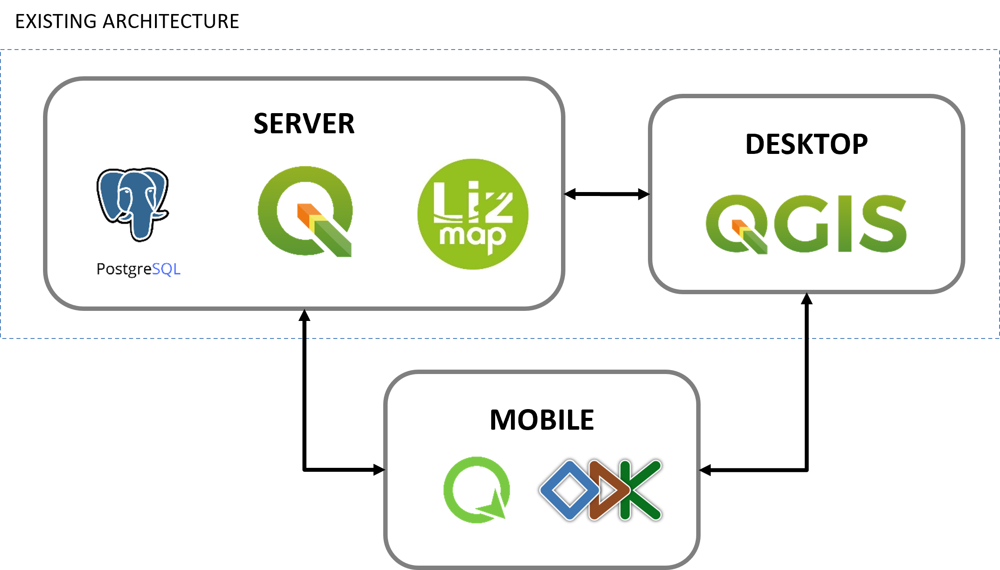

 # road-signs-mapping-validation

Validation and test scripts for road signs map data collected with Qfield and ODK Collect.

## **About** ℹ

This repository contains sample dataset, project draft and validation scripts adopted for the collection and processing of traffic signs in the province of Piacenza mapped with mobile open-source applications.

The repository contains:

* **Sample dataset** with the data structure and table example of traffic signs collected on fields, explaining attributes and accuracy needs for the Italian guidelines;
* **Project draft** on the model for form definition in both QGIS and ODK;

## **Table of contents** 📋

1. **[Piacenza Road Cadastre](#piacenza-road-cadastre)**
2. **[Mobile mapping needs](#mobile-mapping-needs)**
3. **[Qfield](#qfield)**
4. **[ODK Collect](#odk-collect-📋)**
5. **[Data validation](#data-validation-✅)**
6. **[Data sources](#data-sources)**
7. **[Acknowledgements](#acknowledgements)**

------------------------

## **Piacenza road cadastre**

In agreement with the official national requirements, in 2019 the Province of Piacenza adopted and implemented a [digital cadastre](https://catastostrade.provincia.pc.it/lizmap/lizmap/www/index.php/view/map/?repository=progettipubblici&project=catasto_strade_pub) with GIS and WebGIS functionalities built on top of free and open-source software. In particular, on the server side, **PostgreSQL** is used as database management system together with the **PostGIS** extension for enabling the manipulation of geographical data and **QGIS** for the manipulation of geodata. **QGIS Server** is used for the publication of web geographic services, while **Liz Map** PHP application is used for the dynamic generation of a web map application, with its user interface configuration. Public administrators can access the geodatabase through **QGIS Desktop**, manipulating, updating, and styling vector and raster data.

## **Mobile mapping needs**

The designated tools should be installable on smartphones or tablet devices and should have the ability to collect and edit data with attributes in different formats, ranging from simple text and numbers to datetime and geometry. In particular, they should be able to implement widgets (e.g. drop down menus, check boxes, calendar selection) that simplify and speed up the procedure of data form filling. Also, the form structure has to be easily customizable and updatable to any future road cadastre changes. Lastly, the output file resulting from in-situ operations should be in an open format compatible with the QGIS-PostgreSQL architecture. An important consideration that emerged in this phase consisted in the geolocation data quality assessment of the surveyed traffic signs according to the national guidelines that required a maximum uncertainty of 5 meters. However, a sub-metrical accuracy is strongly suggested for optimal positioning.

## **Qfield**

[...]

## **ODK Collect** 📋

[...]

## **Data validation** ✅

The data collected with both applications were reviewed in QGIS environment in a validation phase aimed at identifying differences between the dataset, their completeness, their position accuracy and their coherence with a ground truth represented by photos of corresponding traffic signs taken on field with mobile devices. First, the validation consisted in checking if the mapped elements were located within buffers calculated along the surveyed streets and then evaluating the coherence between the street code inserted in the element field and the one of the roads in whose buffer such sign is included. Hence, a similar approach was  adopted for comparing the value of municipality associated to the single traffic sign to the administrative boundaries within which it falls. A semantic validation on the traffic sign type documented with the mobile mapping was conducted by comparing values with what was depicted in photos taken on field. The entire validation routine process was automatized as much as possible with Python scripts using the PyQGIS library.

## **Data Sources**

Data aboout provincial roads and Piacenza municipalities boundaries are openly available on the official [Provincia di Piacenza Road Cadastre](https://catastostrade.provincia.pc.it/lizmap/lizmap/www/index.php/view/map/?repository=progettipubblici&project=catasto_strade_pub) WebGIS platform.

Example of data collected on field by test operators using ODK Collect can be found in the [odk-collect/data](https://github.com/labmgf-polimi/road-cadastre-traffic-signs/tree/main/odk-collect) folder.

## **Acknowledgements**

The authors thank Roberta Fagandini from GTER - the company that is responsible for the system administration of the Road Cadastre of the Province of Piacenza – for her support in troubleshooting the data management at server level.

Special thanks also to the Servizi Territoriali group of Provincia di Piacenza for the support and collaboration demonstrated along the entire testing and validation process.